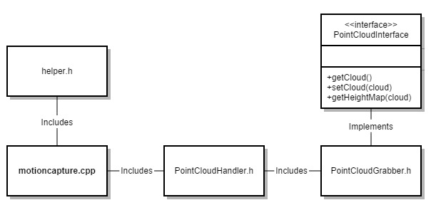

I have been working with the [Pointclouds](pointclouds.org) library and the project is progressing. I have been able to "grab" (as it is called on the site for I/O interaction) a pointcloud from the Xtion I/O device. The issue we're facing is that we would like to abstract the third party software as much as possible so we're not depending on their data structures. If we define our own data structures the library itself will be more modular and easy to manipulate for future parties. 
 
 

In the simple UML here you can see that the third party software is separated enough from the main code that the helper class should be the template for any return values provided by the grabber class. This grabber class is further secured by an interface driving its primary functions. The interesting thing here about the [Pointclouds](pointclouds.org) implementation of the grabber is that it sets up what the interface which will run the callback function cloud_cb_(). This callback function will manipulate the cloud structure before returning to the calling function which may or may not be looping the callback . This is so that you can set up the device to run in a multithreaded fashion. You can start the device, run the callback function, and kill the open connection to the device whenever you'd like. I believe this is why it is set up this way here, whether or not it HAS to be this way is beyond me at the moment. An example of this is as follows:


boost::function::ConstPtr &)> f =
    boost::bind (&PointCloudGrabber::cloud_cb_, this, _1);

interface->registerCallback (f);

interface->start ();


then the callback function will be:


void cloud_cb_ (const pcl::PointCloud::ConstPtr &cloud)
    {
        //do something with the cloud here
    }


So getting the cloud is no problem. Manipulating it so that it is in our own desired data structure is a bit of a different story. Once we do get the cloud in our datastructure we plan to create a heightmap. Whether this is something like a [Perlin Noise](http://en.wikipedia.org/wiki/Perlin_noise) function is to be determined, but the goal is the heightmap. Once we have that, we will be able to send the environmental data to the hardware (hopefully at around 10Hz) so that we can make calculations based on the environment. Once all of this comes together (or probably sooner) I will get started on the IMU. And this is one bad ass IMU. The [LORD MicroStrain 3DM-GX4-25](http://www.microstrain.com/inertial/3dm-gx4-25) is an industrial Attitude Heading and Reference System (AHRS) that could work well on a helicopter. More to come on this monster.