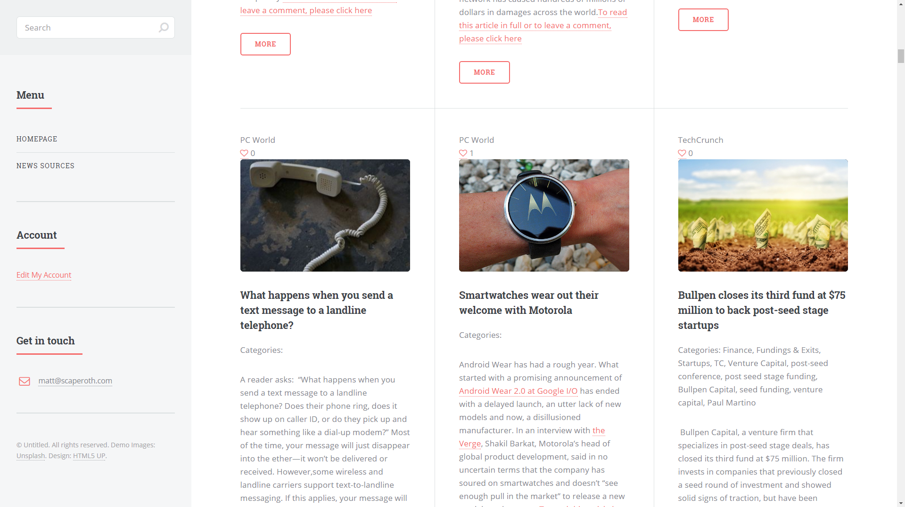
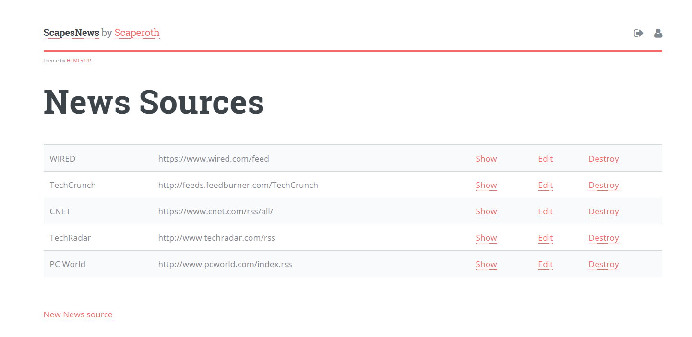

> The code for the front-end can be <a href="https://github.com/scaperoth/scapes_news" target="_blank">found on GitHub here</a>

One day I decided that I didn't want my news by category, geo, or typical aggregations. I simply wanted to choose the sources I trusted and aggregate the results into news that I found interesting. That's why I created this news application, Scapes News. 

 
It is a simple application that allows the user to provide the link to an xml feed they find interesting through a basic dashboard, then it parses out the information into an easy-to read format.

Is this going to change the world? No. But it is useful if you want to take directly control of your news sources to cut out the noise. 
