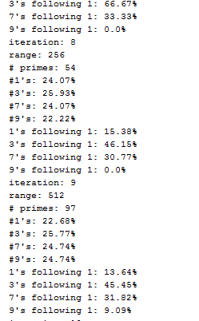
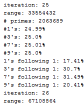

> The code for the simulation can be <a href="https://github.com/scaperoth/PrimeTest" target="_blank">found on GitHub here</a>

The other day, I heard a friend talk about a new discovery in prime numbers (Yes, I know..., and yes, that's the kind of stuff we talk about). The study, done by Kannan Soundararajan and Robert Lemke Oliver of Stanford University in California, suggests that prime numbers are not actually random! If you missed this news, there were articles written about it <a href="https://www.sciencenews.org/article/mathematicians-find-peculiar-pattern-primes" target="_blank">here</a>, <a href="http://www.nature.com/news/peculiar-pattern-found-in-random-prime-numbers-1.19550" target="_blank">here</a>, <a href="https://www.newscientist.com/article/2080613-mathematicians-shocked-to-find-pattern-in-random-prime-numbers/" target="_blank">here</a>, etc...

I thought I'd try out the simulation myself and I received similar results.

 